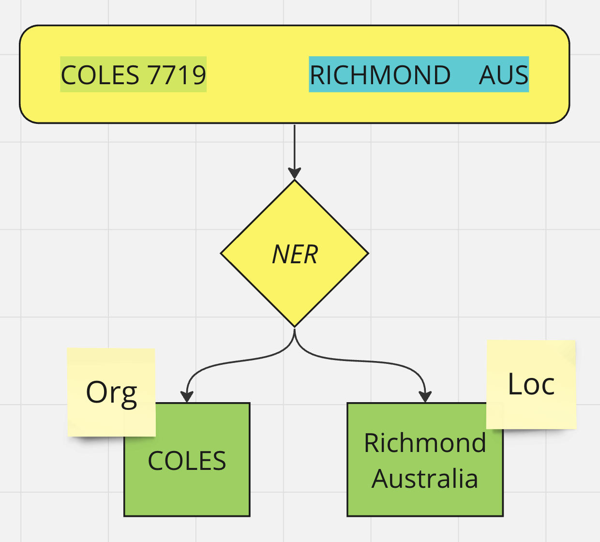
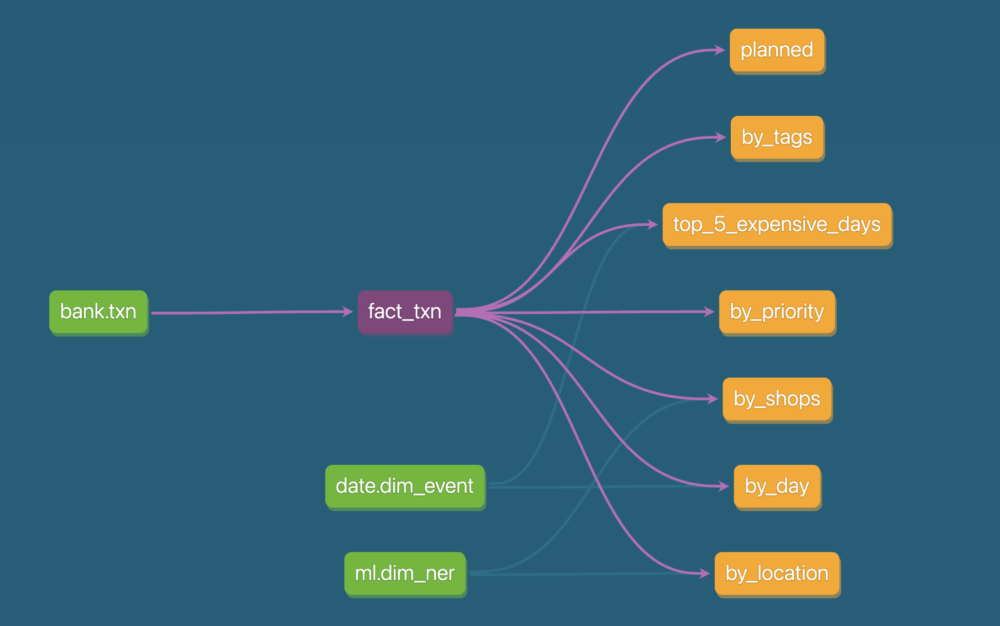

# dbt-banking-ner
This is a simple proof of concept project which aims to asses utility of DuckDB as a quick and efficient analytical tool. 

This project creates a few reports based on personal banking transactions using `dbt` and syncs the reports back as `CSVs`. 

Further, `Named Entity Recognition` is used identity name of the shop and the location of transaction based on transaction description. Python API for DuckDB is used to persist the results back into the database and do ML inference. 

## Named Entity Recognition

# dbt DAG

